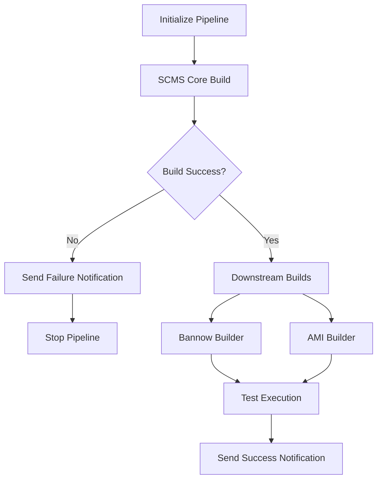

# Jenkins Shared Library - SD Build Pipeline

## Overview

This repository contains a Jenkins shared library that modernizes and modularizes the SD (Services Director) build pipeline. The library provides reusable components, utilities, and standardized practices for building, testing, and deploying SD components across multiple environments.

## 🏗️ Architecture

The shared library is structured following Jenkins best practices:

```
├── vars/                           # Global variables and pipeline steps
│   ├── sdBuildPipeline.groovy     # Main pipeline orchestrator
│   ├── scmsBuild.groovy           # SCMS core build step
│   ├── bannowBuild.groovy         # Bannow builder step
│   ├── amiBuild.groovy            # AMI builder step
│   ├── testSuite.groovy           # Test suite orchestrator
│   └── *Utils.groovy              # Utility variable declarations
├── src/com/company/jenkins/        # Utility classes
│   ├── GitUtils.groovy            # Git operations
│   ├── BuildUtils.groovy          # Build operations
│   ├── ArtifactUtils.groovy       # Artifact management
│   ├── TestUtils.groovy           # Test execution
│   └── NotificationUtils.groovy   # Notifications
├── resources/                      # Configuration files
│   └── jenkins-config.properties  # Default configurations
└── README.md                       # This file
```

## 🚀 Features

### ✅ **Modular Design**
- Separate utility classes for different concerns
- Reusable pipeline steps
- Clear separation of responsibilities

### ✅ **Enhanced Error Handling**
- Proper try-catch blocks with meaningful error messages
- Build dependency management (subsequent builds only run if SCMS succeeds)
- Graceful failure handling with notifications

### ✅ **Smart Notifications**
- Rich email notifications with emojis and structured information
- Different notification types (success, failure, unstable, aborted)
- Detailed build information and troubleshooting guidance

### ✅ **Flexible Configuration**
- Parameterized pipeline for different environments
- Configurable timeouts and retry mechanisms
- Support for parallel and sequential execution

### ✅ **Comprehensive Testing**
- Multiple test types (smoke, analytics, upgrade, version-specific)
- Parallel test execution
- Test result analysis and reporting

### ✅ **Artifact Management**
- Automated artifact packaging and deployment
- Remote server synchronization
- Artifact retention and cleanup policies

## 📋 Prerequisites

1. **Jenkins Setup**:
   - Jenkins 2.x with Pipeline plugin
   - Email Extension plugin for notifications
   - Git plugin for repository operations

2. **Node Configuration**:
   - `scms_build_centos_va` - For SCMS core builds
   - `bannow-builder` - For Bannow builds
   - `ami-builder` - For AMI creation
   - `baxter` - For test execution

3. **Credentials**:
   - Git credentials configured in Jenkins
   - SSH keys for remote server access
   - Email server configuration

## 🔧 Setup Instructions

### 1. Configure Shared Library

1. In Jenkins, go to **Manage Jenkins** → **Configure System**
2. Scroll to **Global Pipeline Libraries**
3. Add a new library:
   - **Name**: `your-shared-library`
   - **Default version**: `main`
   - **Retrieval method**: Modern SCM
   - **Source Code Management**: Git
   - **Repository URL**: Your repository URL

### 2. Create Pipeline Job

1. Create a new Pipeline job in Jenkins
2. In the Pipeline section, select "Pipeline script from SCM"
3. Configure Git repository settings
4. Set **Script Path** to `Jenkinsfile.shared-library`

### 3. Configure Parameters

The pipeline supports the following parameters:

| Parameter | Description | Default |
|-----------|-------------|---------|
| `GIT_BRANCH` | Git branch to build | `master` |
| `GIT_CREDENTIALS` | Git credentials ID | `git-credentials` |
| `GIT_URL` | SD Core repository URL | (configured) |
| `GIT_URL1` | SD Build repository URL | (configured) |
| `GIT_URL2` | Test framework repository URL | (configured) |
| `BUILD_JOB` | Build job identifier | `SD-BUILD-MASTER` |
| `NOTIFICATION_EMAIL` | Email for notifications | `pradeep.anand@ivanti.com` |
| `SKIP_TESTS` | Skip test execution | `false` |
| `PARALLEL_BUILDS` | Enable parallel builds | `true` |
| `LOG_LEVEL` | Build log level | `INFO` |

## 🔄 Pipeline Workflow



### Execution Stages

1. **Initialize Pipeline**: Validate parameters and set up environment
2. **SCMS Core Build**: Build core components on CentOS VA node
3. **Downstream Builds**: Execute Bannow and AMI builds (parallel or sequential)
4. **Test Execution**: Run comprehensive test suites
5. **Notifications**: Send appropriate notifications based on results

## 📧 Notification System

The library includes a comprehensive notification system:

### Success Notifications
- ✅ Lists all completed stages
- 📦 Details about created artifacts
- 🚀 Deployment information

### Failure Notifications
- ❌ Clear error identification
- ⛔ Impact assessment
- 🔧 Troubleshooting steps

### Unstable Notifications
- ⚠️ Quality concerns
- 🔍 Investigation recommendations

## 🧪 Testing Framework

### Test Types
- **Smoke Tests**: Basic functionality verification
- **Analytics Tests**: Data processing and reporting validation
- **Upgrade Tests**: Version migration verification
- **Version Tests**: Version-specific feature testing

### Test Environments
- **KVM**: Virtual machine testing
- **ESX**: VMware environment testing
- **Infrastructure**: UK-based testing infrastructure

## 🛠️ Utility Classes

### GitUtils
- Repository checkout and management
- Commit information extraction
- Branch operations

### BuildUtils
- Build process orchestration
- Environment preparation
- Status management

### ArtifactUtils
- Artifact packaging and deployment
- Remote server synchronization
- Cleanup and retention

### TestUtils
- Test execution across different environments
- Result analysis and reporting
- Environment configuration

### NotificationUtils
- Multi-format notifications (email, Slack)
- Rich message formatting
- Recipient management

## 🔍 Usage Examples

### Basic Pipeline Usage

```groovy
@Library('your-shared-library') _

pipeline {
    agent none
    stages {
        stage('Build') {
            steps {
                script {
                    scmsBuild {
                        gitBranch = 'master'
                        gitCredentials = 'git-credentials'
                        gitUrl = 'https://github.com/company/sd-core.git'
                    }
                }
            }
        }
    }
}
```

### Custom Configuration

```groovy
@Library('your-shared-library') _

pipeline {
    agent none
    stages {
        stage('Custom Build') {
            steps {
                script {
                    sdBuildPipeline {
                        gitBranch = 'develop'
                        parallelBuilds = false
                        skipTests = true
                        notificationEmail = 'team@company.com'
                    }
                }
            }
        }
    }
}
```

## 📊 Monitoring and Troubleshooting

### Build Monitoring
- Real-time build status in Jenkins UI
- Email notifications for all stakeholders
- Detailed console logs with emoji indicators

### Common Issues

1. **Node Unavailable**: Check Jenkins node configuration
2. **Git Authentication**: Verify credentials in Jenkins
3. **Test Failures**: Review test logs and environment setup
4. **Artifact Deployment**: Check network connectivity and permissions

### Debug Mode
Set `LOG_LEVEL` parameter to `DEBUG` for verbose logging.

## 🔄 Migration from Legacy Pipeline

### Steps to Migrate

1. **Backup Current Pipeline**: Save existing Jenkinsfile
2. **Install Shared Library**: Configure in Jenkins
3. **Update Job Configuration**: Point to new Jenkinsfile
4. **Test with Non-Production Branch**: Verify functionality
5. **Update Parameters**: Configure job parameters
6. **Deploy to Production**: Switch to shared library pipeline

### Benefits of Migration

- ✅ **50% Reduction** in pipeline code duplication
- ✅ **Improved Maintainability** with modular design
- ✅ **Enhanced Error Handling** with better notifications
- ✅ **Standardized Practices** across all builds
- ✅ **Better Testing** with comprehensive test suites

## 🤝 Contributing

1. Fork the repository
2. Create feature branch: `git checkout -b feature/new-feature`
3. Commit changes: `git commit -m 'Add new feature'`
4. Push to branch: `git push origin feature/new-feature`
5. Submit pull request

### Development Guidelines

- Follow Groovy coding standards
- Add documentation for new features
- Include unit tests where applicable
- Update configuration files as needed

## 📝 License

This project is licensed under the MIT License - see the LICENSE file for details.

## 📞 Support

For support and questions:

- **Primary Contact**: pradeep.anand@ivanti.com
- **Team Email**: jenkins-support@company.com
- **Documentation**: Internal Wiki
- **Issues**: GitHub Issues (if applicable)

---

**Version**: 1.0.0  
**Last Updated**: November 2025  
**Maintainers**: DevOps Team